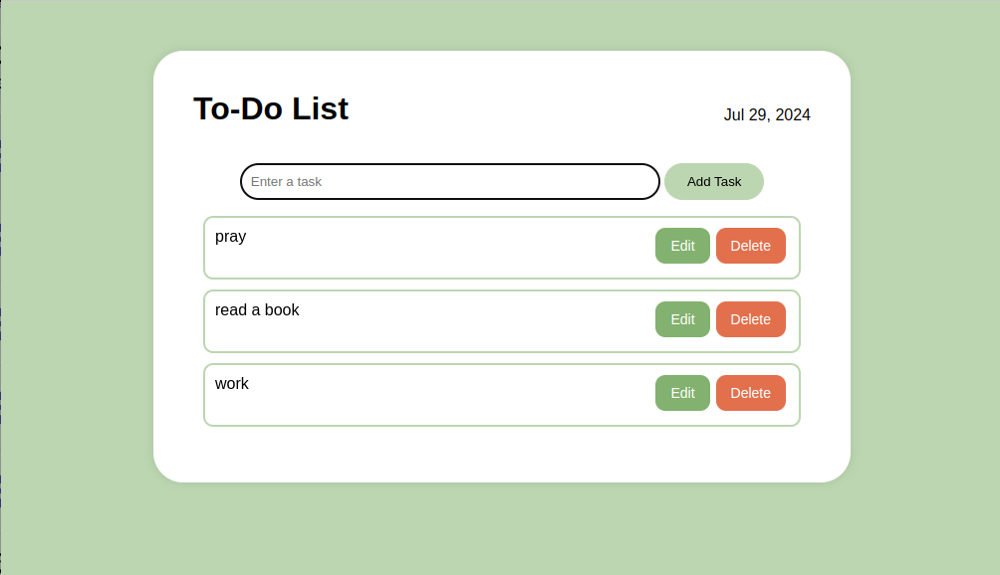

# To-Do List App

A simple and intuitive web-based application to help you manage your daily tasks and stay organized.

## Features

- **Add Tasks**: Create new tasks with description.

- **Edit Tasks**: Modify the details of existing tasks.
- **Delete Tasks**: Remove tasks that are no longer relevant.

## Getting Started

1. Clone the repository:
git clone https://github.com/your-username/todo-list.git
2. Navigate to the project directory:
cd todo-list
3. Open the `index.html` file in your web browser.

## Usage

1. Add a new task by entering it's description in the input fields, then clicking the "Add Task" button.
2. Manage your tasks by  editing the details, or deleting them using the provided buttons.

## ScreenShot

