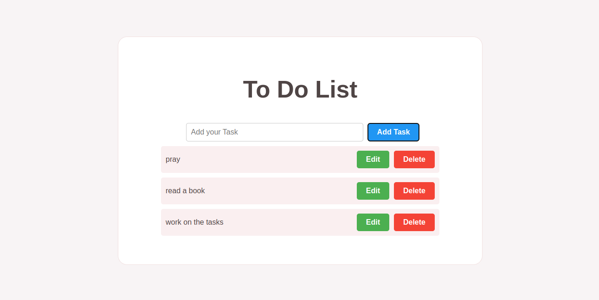
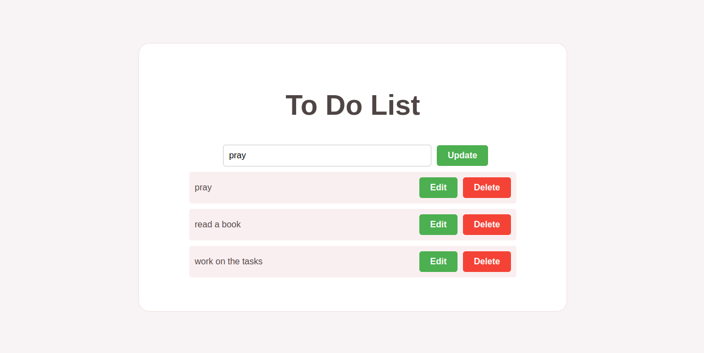
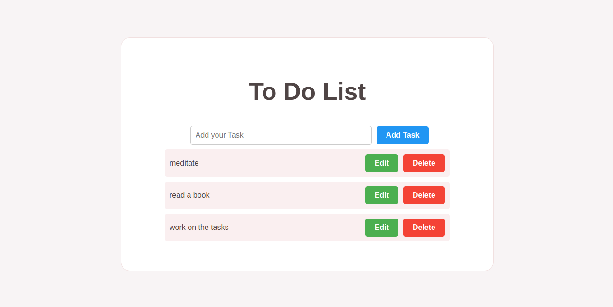

# Task Manager

A simple task management application built with React, TypeScript, and CSS.

## Features

- Add new tasks
- Mark tasks as completed
- Edit task names
- Delete tasks
- Responsive design

## Getting Started

### Prerequisites

- Node.js (version 14 or higher)
- npm (version 6 or higher)

### Installation

1. Clone the repository:

```bash
git clone https://github.com/your-username/task-manager.git
```

2. Navigate to the project directory

```bash
cd task-manager
```

3. Install the dependencies:

```bash
npm install
```

### Running the App

1. Start the development server:

```bash
npm start
```

2. Open your web browser and navigate to http://localhost:3000.

### Usage

1. Type the task name in the input field and press "Add" to create a new task.
2. Click the "Edit" button to modify a task's name.
3. Click the "Delete" button to remove a task.
4. Click the task item to mark it as completed or uncompleted.

### Technologies Used

React
TypeScript
CSS

### Screenshots

Add Task


Update Task


Updated Task

