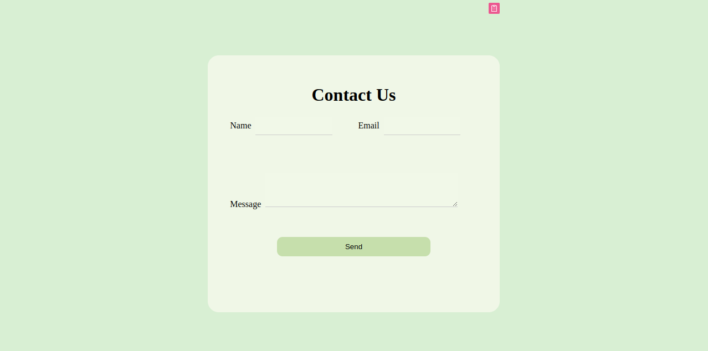
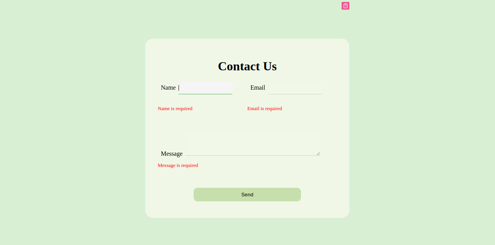
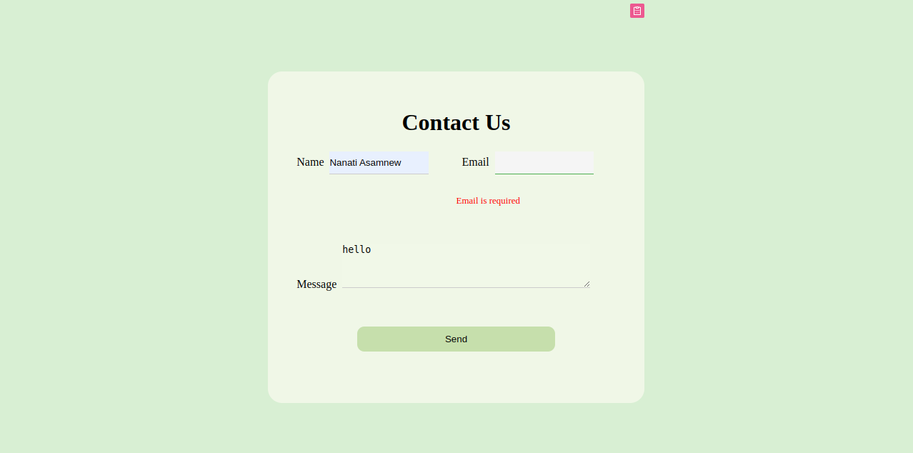

# Contact Form Validation with React

## Introduction

This is a simple React component that implements a contact form with client-side validation. The form includes fields for name, email, and message, and it ensures that all fields are filled out correctly before allowing the form to be submitted.

## Features

- Validates that all fields are filled out
- Ensures that the email field contains a valid email address
- Provides clear and user-friendly error messages
- Leverages React's built-in state management and event handling

## Installation

To use this component in your project, follow these steps:

1. Clone the repository:

```bash
git clone https://github.com/your-username/contact-form-validation.git
```

2. Navigate to the project directory:

```bash
cd  Task-5-Form
```

3. Install the dependencies:

```bash
npm install
```

### The ContactForm component will render a form with the following fields:

Name (required)
Email (required and must be a valid email address)
Message (required)
If any of the fields are left empty or the email is invalid, the form will not submit and will display an error message. Once all fields are filled out correctly, the form can be submitted

## Screenshots

The form


If the fields are not filled


If the email is not valid email

